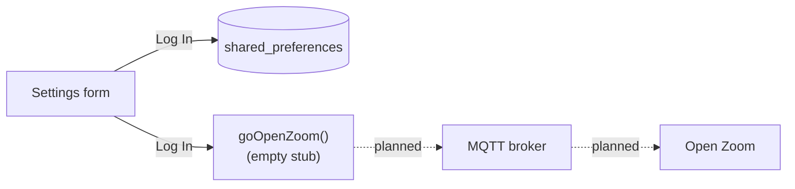

# ZoomQtt

ZoomQtt is a Flutter mobile app (Android and iOS) meant to bridge MQTT and Zoom. The goal is
that a message on an MQTT topic, for example from a home-automation system, opens Zoom on the
phone.

> [!WARNING]
> **Status: early prototype, not functional yet.** The code on `main` has only the settings
> screen. It saves the MQTT broker address, username, password and topic on the device. It does
> **not** connect to an MQTT broker, and it does **not** open or control Zoom yet. The method that
> should open Zoom (`goOpenZoom()` in `lib/main.dart`) is an empty stub. More work, including an
> MQTT client, is in progress in [PR #1](https://github.com/t0mer/ZoomQtt/pull/1). That work is
> not merged yet.

> [!NOTE]
> ZoomQtt is an independent, unofficial project. It is not affiliated with, endorsed by or
> sponsored by Zoom Video Communications, Inc. "Zoom" is a trademark of its owner.

## Table of contents

- [Features](#features)
- [How it works](#how-it-works)
- [Requirements](#requirements)
- [Build and run](#build-and-run)
- [Configuration](#configuration)
- [MQTT topics](#mqtt-topics)
- [Troubleshooting](#troubleshooting)
- [Security notes](#security-notes)
- [Development](#development)
- [Contributing](#contributing)
- [License](#license)

## Features

What the code on `main` does today:

- A single screen with four fields: **Address**, **Username**, **Password** (masked input) and
  **Topic**.
- Saves the four fields on the device with
  [`shared_preferences`](https://pub.dev/packages/shared_preferences) when you tap **Log In**.
- Loads the saved values back into the form when the app starts.
- Android and iOS projects with the app ID `il.co.smarthome.zoomqtt`.

Not implemented on `main`:

- No MQTT connection. `pubspec.yaml` has no MQTT client library.
- No Zoom integration. There is no Zoom SDK, no deep link and no URL launcher. **Log In** saves
  the settings and then calls an empty method.
- The **Clear form** button does nothing yet (its `onPressed` handler is empty).
- The logo and footer are text placeholders ("logo here", "Footer + link here").

## How it works

The intended flow, and how much of it exists on `main`:



1. On start, `getSharedPrefs()` reads the saved values and fills the form.
2. On **Log In**, `saveDataToPrefs()` writes the form values to `shared_preferences`, then
   `goOpenZoom()` runs. That method is empty.
3. Subscribing to the topic and opening Zoom are the planned next steps. They are not in the code
   on `main`.

## Requirements

- **An older Flutter SDK (1.x).** The code was written in early 2021 for Dart 2.7+ with no null
  safety, and it uses the `FlatButton` widget. Current Flutter 3 / Dart 3 SDKs do not compile it
  without changes.
  - `pubspec.yaml`: `sdk: ">=2.7.0 <3.0.0"`
  - `pubspec.lock`: Dart `>=2.10.0-110 <2.11.0`, Flutter `>=1.12.13+hotfix.5 <2.0.0`
    (for example Flutter 1.22.x with Dart 2.10) <!-- TODO: verify the exact Flutter version used -->
- **Android:** minSdk 16, target/compile SDK 29, Kotlin 1.3.50 (from `android/app/build.gradle`
  and `android/build.gradle`).
  - The project pins Gradle 5.6.2 (`android/gradle/wrapper/gradle-wrapper.properties`) and the
    Android Gradle Plugin 3.5.0 (`android/build.gradle`). The Android build needs **JDK 8 or 11**,
    because Gradle 5.6 doesn't run on JDK 17 or 21.
  - `android/build.gradle` uses the `jcenter()` repository, which is deprecated. You may need to
    replace it with `mavenCentral()` if dependencies fail to resolve.
  - Permissions: the release `AndroidManifest.xml` has no INTERNET permission (only the debug and
    profile manifests do), so a release build couldn't reach a broker once MQTT is added.
- **iOS:** deployment target 9.0 (from `ios/Runner.xcodeproj`). Building needs macOS with a
  Flutter 1.22-era Xcode (12.x). Current Xcode versions don't support a 9.0 deployment target with
  that toolchain. <!-- TODO: verify -->
- An MQTT broker, once the MQTT connection exists (see status above).

## Build and run

No releases, tags or prebuilt APKs are published, so you build the app from source.

```bash
git clone https://github.com/t0mer/ZoomQtt.git
cd ZoomQtt
flutter pub get
flutter run                 # on a connected device or emulator
```

For Android builds, run these with JDK 8 or 11 (see [Requirements](#requirements)).

Build an Android APK:

```bash
flutter build apk           # output: build/app/outputs/flutter-apk/app-release.apk
```

Build for iOS (macOS with Xcode only):

```bash
flutter build ios
```

The Android `release` build type is signed with the **debug** key (see `android/app/build.gradle`).
That is fine for testing but not for distribution.

## Configuration

All settings come from the form on the main screen. They are stored in `shared_preferences`
(`SharedPreferences` on Android, `NSUserDefaults` on iOS).

| Field | Preference key | Description |
|-------|----------------|-------------|
| Address | `prefBrokerAddress` | MQTT broker address, for example `broker.example.com`. <!-- TODO: verify expected format (host, host:port or URL) once the MQTT client exists --> |
| Username | `prefUsername` | MQTT username. |
| Password | `prefPassword` | MQTT password. Masked in the form, stored in **plain text**. |
| Topic | `prefTopic` | MQTT topic to listen on, for example `home/zoom`. |

Leading and trailing spaces are trimmed from each value before it is saved (the field itself
still shows them). There are no defaults, environment variables or config files.

## MQTT topics

`main` has no MQTT client, so the app does not subscribe or publish to any topic yet. The
**Topic** field is only saved. The payload format that will open Zoom is not defined in the code.

<!-- TODO: verify topic and payload format once the MQTT client is merged -->

## Troubleshooting

- **Nothing happens after "Log In".** This is expected on `main`. **Log In** only saves the
  settings, and the Zoom/MQTT step (`goOpenZoom()`) is an empty stub.
- **"Clear form" does nothing.** Its handler is empty on `main`.
- **Saved values are missing the next time the app starts.** The save step writes values captured by
  each field's `onChanged` handler. A field you did not edit in the current session is saved as
  `null`, which removes the stored value. Re-enter every field before tapping **Log In**.
- **Build errors on a current Flutter SDK** (for example about `FlatButton` or null safety). Use a
  Flutter 1.x SDK, see [Requirements](#requirements).
- **`flutter test` fails.** `test/widget_test.dart` is still the default Flutter counter test, and
  it does not match this app.

## Security notes

- The MQTT password is stored in plain text in `shared_preferences`. Treat the device as trusted,
  and use a dedicated MQTT user with access limited to the topics it needs.
- Prefer a broker with TLS, and don't expose your broker to the internet without authentication.
- Never commit real broker addresses, credentials, signing keys or keystore passwords to the
  repository.

## Development

Project layout:

```
lib/main.dart          # the whole app: MyApp + ZoomQtt settings screen
test/widget_test.dart  # default Flutter template test (not updated for this app)
android/               # Android project (app ID il.co.smarthome.zoomqtt)
ios/                   # iOS project (bundle ID il.co.smarthome.zoomqtt)
pubspec.yaml           # dependencies: flutter, shared_preferences ^0.5.12+4, cupertino_icons ^1.0.0
```

Common commands:

```bash
flutter pub get
flutter analyze
flutter test
```

There is no CI workflow in this repository.

## Contributing

Issues and pull requests are welcome. Before you start, look at the open
[PR #1](https://github.com/t0mer/ZoomQtt/pull/1). It has further work that is not on `main` yet,
so check it first to avoid duplicate work.

## License

ZoomQtt is licensed under the [GNU General Public License v3.0](LICENSE).
